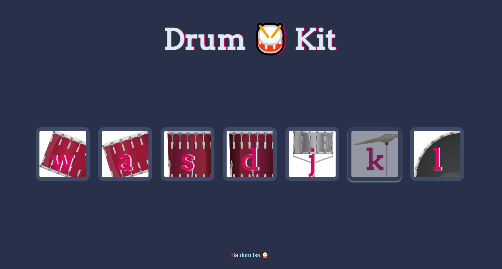

# DrumKit - virtual drum kit

## Table of contents

* [General info](#general-info)
* [Screenshots](#screenshots)
* [Inspiration](#inspiration)

## _General info_

This is a simple JavaScript drum kit. Using the addEventListener method and the function that uses switch statement, after pressing the appropriate element with the cursor or pressing the appropriate button on the keyboard it's going to play the corresponding drum sound effect and shows a visual effect as feedback for the user (as you can see on screenshot).

## _Screenshots_

## _Inspiration_

 Project inspired by [Angela Yu](https://www.appbrewery.co)
